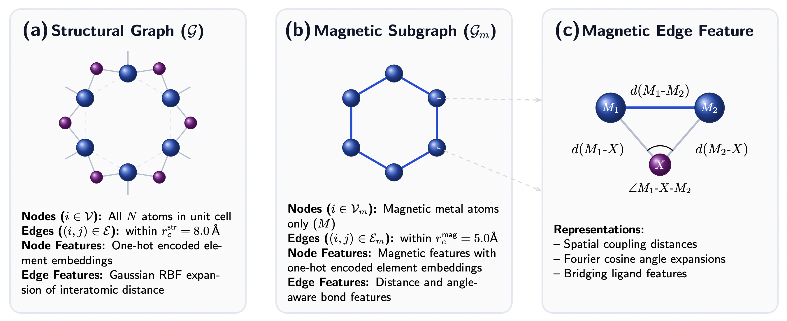
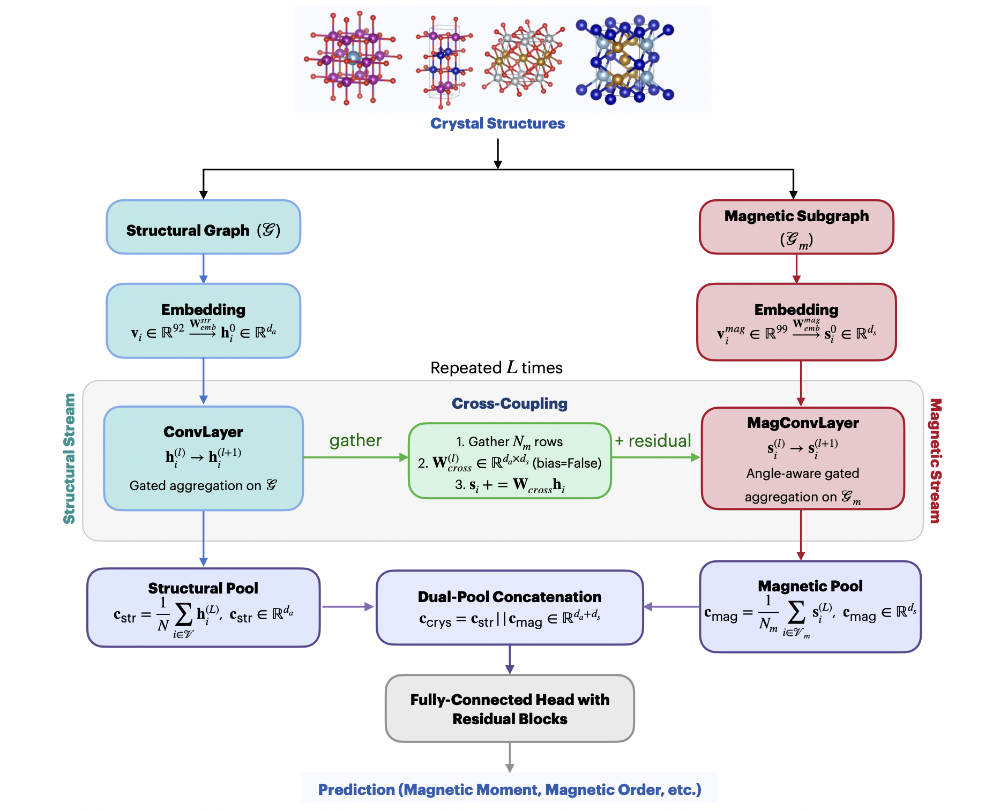

# mCGCNN

**mCGCNN** is a dual-stream crystal graph convolutional neural network for the efficient prediction of magnetic properties of crystalline materials.

Its main features include:

- A **dual-stream architecture** that augments the full crystal graph with a dedicated magnetic subgraph.
- **Angle-aware message passing** on the magnetic subgraph using metal–ligand–metal exchange-path descriptors motivated by the Goodenough–Kanamori–Anderson (GKA) rules.
- **Layer-wise cross-coupling** that transfers structural and ligand-field information from the full crystal graph to the magnetic stream.
- A **magnetic-sublattice pooling** operation that prevents magnetic information from being diluted by nonmagnetic atoms.
- A **physics-informed graph representation** that directly incorporates exchange geometry into graph neural networks for predictive modeling of magnetic materials.

## Dual graph representation in the mCGCNN architecture



## Architecture of mCGCNN



## Generate Dual Graph Representations

Before training or inference, the crystal structures must be converted into dual graph representations consisting of **crystal graph** and its corresponding **magnetic subgraph**.

### Dataset Organization

Organize your dataset as follows:

```text
sample_dataset/
├── dataset.csv
├── atom_init.json
├── magnetic_atom_init.json
├── material_1.cif
├── material_2.cif
├── material_3.cif
└── ...
```
where
* `dataset.csv` contains the material IDs and target properties.
* `atom_init.json` contains the elemental feature vectors as used in CGCNN.
* `magnetic_atom_init.json` contains the magnetic elemental feature vectors.
* `*.cif` files contain the crystal structures.  

The first column of `dataset.csv` must contain the material IDs, which **must exactly match** the corresponding CIF filenames (without the `.cif` extension).

For example,

| **material_id** | **tot_mom_mub** |
| :--- | :--- |
| mp-100 | 5.82 |
| mp-101 | 1.37 |
| mp-102 | 0.00 |

where **tot_mom_mub** denotes the DFT total magnetic moment per unit cell in $\mu_B$.

### Generate the Graphs

Run
```bash
python preprocess.py sample_dataset --target tot_mom_mub 
```
By default, the generated graph files are written to
```text
sample_dataset/
├── processed_graphs/
│   ├── mp-100.pt
│   ├── mp-101.pt
│   ├── mp-102.pt
│   └── ...
```
Each generated `.pt` file stores the crystal graph, magnetic subgraph, magnetic-to-structural index mapping, target property, and material ID.

### Using Multiple CPU Cores

By default, `preprocess.py` uses all available CPU cores. To specify the number of worker processes manually, run:

```bash
python preprocess.py sample_dataset --target tot_mom_mub --workers 8
```

## Train the Model

Once the dual graphs are generated, you can train the mCGCNN model using `train.py`. The script handles dataset splitting, data normalization for regression, model initialization, and training.

### Basic Training Run:

To run the model with default hyperparameters, simply provide the path to the directory containing your generated `.pt` files:

```bash
python train.py --data_dir sample_dataset/processed_graphs
```
By default, the script creates an `outputs/` directory in the root folder containing:

* `training.log`: A text log of training metrics and environment setup.
* `dataset_splits.pt`: The exact train/val/test indices used, to ensure exact reconstruction of the test set later.
* `best_mcgcnn.pt`: The saved model weights and normalizer states from the epoch with the lowest validation loss.

### Advanced Training Run:

You can easily customize hyperparameters, paths, and random seeds directly from the command line. To keep the folder organized, you can also specify a custom output directory for specific runs:
```bash
python train.py --data_dir sample_dataset/processed_graphs --out_dir training_runs/run_01 --epochs 150 --batch_size 128 --lr 1e-4 --lr_milestones 80 120 --seed 42
```


## License

This project is licensed under the **MIT License**.

See the [LICENSE](LICENSE) file for details.


## Citation

Please consider citing our work if you find it helpful:

```bibtex
@misc{mal2026mcgcnndualstreamcrystalgraph,
      title={mCGCNN: A Dual-Stream Crystal Graph Convolutional Neural Network for the Efficient Prediction of Magnetic Properties of Crystalline Materials}, 
      author={Sourav Mal and Satadeep Bhattacharjee},
      year={2026},
      eprint={2606.28458},
      archivePrefix={arXiv},
      primaryClass={cond-mat.mtrl-sci},
      url={https://arxiv.org/abs/2606.28458}, 
}
```


